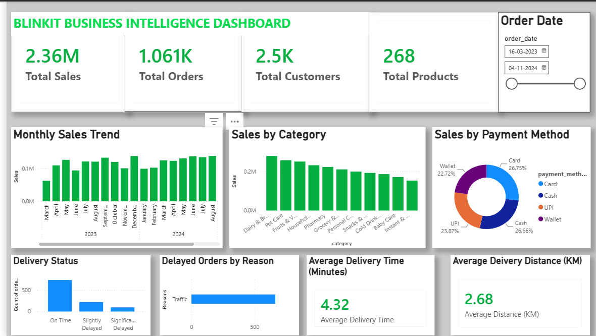

# Blinkit Business Intelligence & Sales Analytics

## Project Overview

An end-to-end Business Intelligence project built to analyze Blinkit's sales, customer, product, payment, and delivery performance.

The project combines Python for data cleaning, MySQL and SQL for data analysis, and Power BI for interactive business reporting and visualization.

## Business Objectives

- Analyze overall sales and order performance
- Identify high-performing product categories
- Understand customer and payment behavior
- Evaluate delivery performance
- Identify major causes of delayed orders
- Analyze monthly sales trends
- Build an interactive business dashboard

## Tools & Technologies

- Python
- Pandas
- MySQL
- SQL
- Power BI
- Excel

## Project Workflow

Raw Data  
↓  
Python / Pandas Data Cleaning  
↓  
MySQL Database  
↓  
SQL Business Analysis  
↓  
Power BI Dashboard  
↓  
Business Insights

## Data Cleaning

Python and Pandas were used to prepare the data for analysis.

The cleaning process included:

- Checking data types
- Handling date fields
- Checking missing values
- Identifying duplicate records
- Cleaning order data
- Preparing analysis-ready CSV files

## SQL Analysis

MySQL was used to store and analyze the cleaned data.

SQL analysis covered:

- Total sales and orders
- Monthly sales performance
- Sales by category
- Payment-method analysis
- Customer analysis
- Product analysis
- Delivery performance
- Delayed-order analysis
- Marketing performance

## Power BI Dashboard

The Power BI dashboard provides an interactive overview of Blinkit's business performance.

### Key KPIs

| KPI | Value |
|---|---:|
| Total Sales | ₹2.36M |
| Total Orders | 1,061 |
| Total Customers | 2.5K |
| Total Products | 268 |
| Average Delivery Time | 4.32 minutes |
| Average Delivery Distance | 2.68 km |

The dashboard includes:

- Monthly Sales Trend
- Sales by Category
- Sales by Payment Method
- Delivery Status
- Delayed Orders by Reason
- Average Delivery Time
- Average Delivery Distance
- Order Date slicer

## Key Business Insights

### 1. Category Performance

Dairy & Breakfast generated the highest category-level sales among the displayed categories, while Instant & Frozen Foods recorded the lowest.

### 2. Payment Method

Card accounted for 26.75% of sales and Cash accounted for 26.66%, showing a relatively balanced payment mix.

### 3. Delivery Performance

741 out of 1,061 orders were delivered on time, representing 69.84% of total orders.

222 orders (20.92%) were slightly delayed, while 98 orders (9.24%) were significantly delayed.

### 4. Delay Reason

Traffic was the recorded reason in the available non-blank delay-reason data, highlighting traffic-related issues as an area to monitor for improving delivery performance.

### 5. Monthly Sales

December 2023 recorded the highest monthly sales at ₹1,38,020.10.

## Dashboard Preview



## Project Structure

```text
Blinkit_Business_Intelligence/
│
├── 01_dataset/
├── 02_sql/
├── 03_python/
├── 04_powerbi/
├── 05_images/
└── README.md
